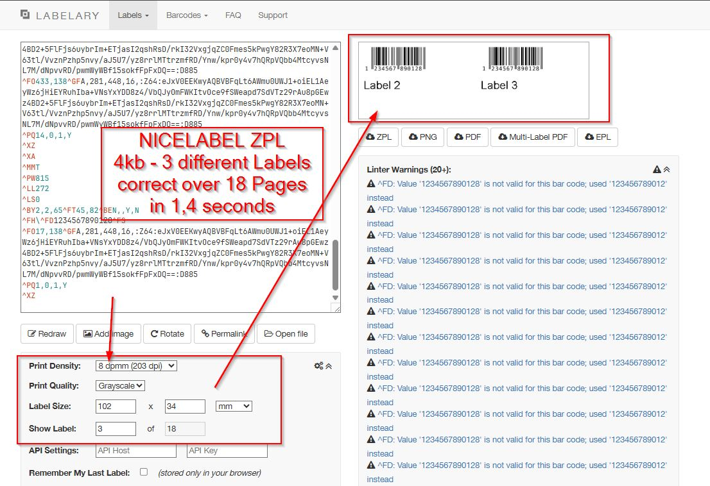
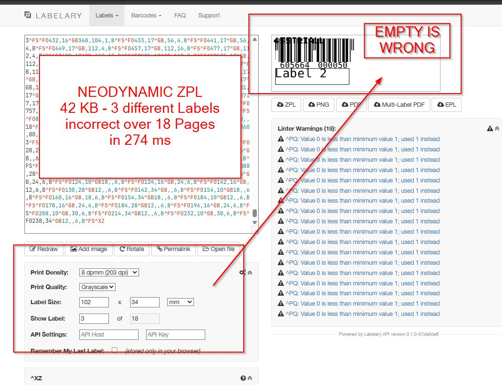
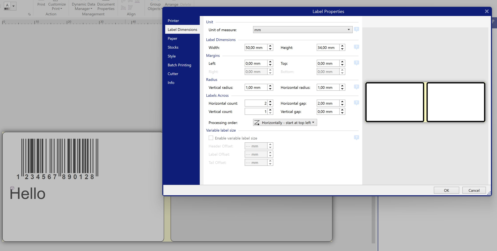

# Nice vs Neo ZPL

Compare of ZPL output with the following data ready as byte printstream in memory

```
return new List<Label>
{
    new Label { Qty = 2, Name = "Label 1", Ean13 = "460566400005"},
    new Label { Qty = 3, Name = "Label 2", Ean13 = "460566400005"},
    new Label { Qty = 30, Name = "Label 3", Ean13 = "460566400005"}
};
```

## ZPL OUTPUT FOR (ALMOST) SAME PRINT RESULT
<a href="zpl-output-neodynamic.txt">zpl-output-neodynamic.txt</a> (41,58kb)<br>
<a href="zpl-output-nicelabel.txt">zpl-output-nicelabel.txt</a> (3,54kb)<br>

## VERSIONS
Neodynamic.SDK.ThermalLabel Version 14.0.25.701 (2025-10-16)
NiceLabel 10.5 Build 21.5.0.11092 (2024-03-29)

## .NET Solution - 3 Projects ##
- data (.NET 2.0 Standard DLL - as 100% same Datasource)
- nice (Nicelabel Console App .NET Framework 4.8)
- neo (NeoDynamic Console App .NET Core 9)

## RESULTS

|  | NiceLabel | NeoDynamic  
| ------------- | ------------- | ------------- |
| Speed of rendering | ⛔ 1.4s  |  ✅ 250ms   | 
| Output Quality (see images below)  |  ✅ correct: one print job with qty per label data   | ⛔ wrong: Not right paged,<br>because of manual merge of multiple print jobs to achieved some kind of qty clone  | 
| Size  |  ✅ 3,5kb using PQ  | ⛔ 41,58kb not using PQ  | 
|  |  |  |
|  | **5x slower but does it right**  | **over 10x larger with wrong output** |

## NiceLabel
After 1477,7476 ms ZPL Printstream ready in memory with 3,54 kb<br>



## NeoDynamic
After 252,2687 ms ZPL Printstream ready in memory with 41,58 kb<br>


## The comparable design

**NeoDynamic**
```
ThermalLabel tLabel = new ThermalLabel(UnitType.Mm, 50, 34);
tLabel.LabelsPerRow = 2;
tLabel.LabelsHorizontalGapLength = 2;

tLabel.Items.Add(new BarcodeItem()
{
    Symbology = BarcodeSymbology.Ean13,    
    DataField = nameof(Label.Ean13),        
    X = 2.0,
    Y = 2.0,
    Width = tLabel.Width - 5,
    Height = 13,
    BarHeight = 14,
    BarWidth = 0.5,
    EanUpcGuardBarHeight = 7,
    //QuietZone = { Bottom = 0.5, Left = 0, Right = 0.0, Top = 0.5 },
    BorderThickness = new FrameThickness(0.1)
});
tLabel.Items.Add(new TextItem
{
    DataField = nameof(Label.Name),
    X = 2,
    Y = 20,
    Width = tLabel.Width - 5,
    Height = 10,
    BorderThickness = new FrameThickness(0.3),
    Font = { Size = 14 },
});
```

**Nicelabel**<br>
